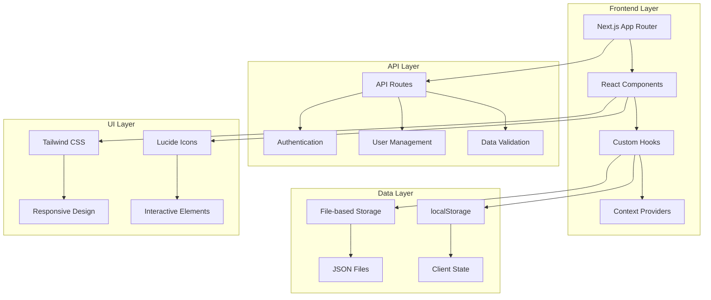
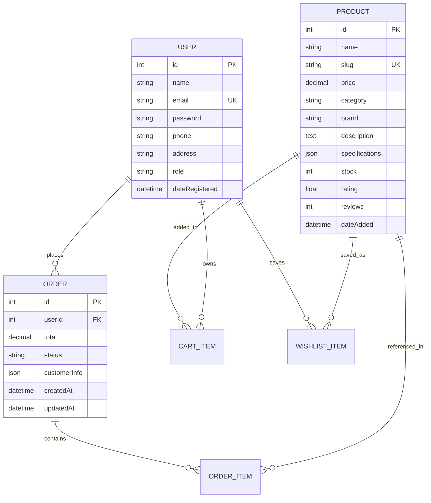
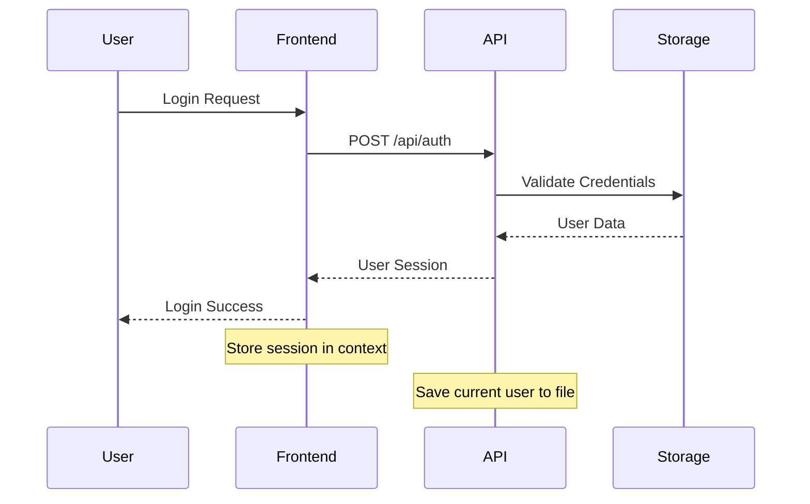

# Dokumentasi Teknis TelecomShop

## Daftar Isi
1. [Gambaran Umum Arsitektur Teknis](#gambaran-umum-arsitektur-teknis)
2. [Dokumentasi API](#dokumentasi-api)
3. [Skema Database & Manajemen Data](#skema-database--manajemen-data)
4. [Arsitektur Komponen](#arsitektur-komponen)
5. [Panduan Pengembangan](#panduan-pengembangan)
6. [Implementasi Keamanan](#implementasi-keamanan)
7. [Optimasi Performa](#optimasi-performa)
8. [Troubleshooting & Maintenance](#troubleshooting--maintenance)

---

## Gambaran Umum Arsitektur Teknis

### Diagram Arsitektur Sistem



### Stack Teknologi

| Teknologi | Versi | Justifikasi |
|-----------|-------|-------------|
| **Next.js** | 15.4.4 | Framework React modern dengan App Router untuk SSR/SSG dan routing otomatis |
| **React** | 19.1.0 | Library UI terbaru dengan concurrent features dan improved performance |
| **Tailwind CSS** | v4 | Utility-first CSS framework untuk rapid development dan konsistensi design |
| **Lucide React** | 0.525.0 | Icon library modern dengan tree-shaking dan customizable |
| **Heroicons** | 2.2.0 | Icon set tambahan untuk variasi visual |
| **Framer Motion** | 12.23.9 | Animation library untuk smooth transitions dan micro-interactions |
| **clsx** | 2.1.1 | Utility untuk conditional className management |

### Struktur Proyek Detail

```
indri/
├── src/
│   ├── app/                    # Next.js App Router
│   │   ├── (admin)/           # Route group untuk admin
│   │   │   └── admin/         # Admin dashboard pages
│   │   ├── (product)/         # Route group untuk produk
│   │   │   └── produk/        # Product listing & detail pages
│   │   ├── api/               # API routes
│   │   │   ├── auth/          # Authentication endpoints
│   │   │   └── users/         # User management endpoints
│   │   ├── cart/              # Shopping cart page
│   │   ├── checkout/          # Checkout process
│   │   ├── login/             # Authentication pages
│   │   ├── register/          # User registration
│   │   ├── profile/           # User profile management
│   │   ├── orders/            # Order history
│   │   ├── about/             # About page
│   │   ├── globals.css        # Global styles & CSS variables
│   │   ├── layout.jsx         # Root layout dengan providers
│   │   └── page.jsx           # Homepage
│   ├── components/            # Reusable React components
│   │   ├── AppNavigation.js   # Main navigation component
│   │   ├── Toast.jsx          # Toast notification system
│   │   └── ToastProvider.jsx  # Toast context provider
│   ├── contexts/              # React Context providers
│   │   └── AuthContext.jsx    # Authentication state management
│   ├── hooks/                 # Custom React hooks
│   │   ├── useAuth.js         # Authentication hook (legacy)
│   │   ├── useDatabase.jsx    # localStorage database operations
│   │   └── useFileDatabase.js # File-based database operations
│   └── data/                  # Static data & storage
│       ├── products.js        # Product database
│       ├── users.json         # User data storage
│       └── currentUser.json   # Current session data
├── public/                    # Static assets
│   ├── products/              # Product images
│   └── tel.png               # Default product image
├── package.json              # Dependencies & scripts
├── next.config.mjs           # Next.js configuration
├── tailwind.config.js        # Tailwind CSS configuration
├── postcss.config.mjs        # PostCSS configuration
├── eslint.config.mjs         # ESLint configuration
└── jsconfig.json            # JavaScript configuration
```

### Pola Desain & Keputusan Arsitektur

#### 1. **Hybrid Storage Pattern**
- **File-based storage** untuk data persisten (users, sessions)
- **localStorage** untuk data sementara (cart, wishlist, preferences)
- **Static files** untuk data produk yang jarang berubah

#### 2. **Component Composition Pattern**
- Komponen kecil dan reusable
- Props drilling dihindari dengan Context API
- Custom hooks untuk logic separation

#### 3. **Route Grouping**
- `(admin)` untuk halaman admin
- `(product)` untuk halaman produk
- Memungkinkan layout berbeda per group

#### 4. **Error Boundary Pattern**
- Safe JSON parsing dengan fallback
- Try-catch blocks untuk localStorage operations
- Graceful degradation untuk missing data

---

## Dokumentasi API

### Base URL
```
Development: http://localhost:3000/api
Production: https://your-domain.com/api
```

### Authentication Endpoints

#### POST /api/auth
**Login User**

```javascript
// Request
{
  "email": "user@example.com",
  "password": "password123"
}

// Response (Success - 200)
{
  "id": 1,
  "name": "John Doe",
  "email": "user@example.com",
  "role": "customer",
  "dateRegistered": "2024-01-15T10:30:00.000Z"
}

// Response (Error - 401)
{
  "error": "Invalid credentials"
}
```

#### GET /api/auth
**Get Current User**

```javascript
// Response (Success - 200)
{
  "user": {
    "id": 1,
    "name": "John Doe",
    "email": "user@example.com",
    "role": "customer"
  }
}

// Response (No Session - 401)
{
  "error": "No active session"
}
```

#### DELETE /api/auth
**Logout User**

```javascript
// Response (Success - 200)
{
  "message": "Logged out successfully"
}
```

### User Management Endpoints

#### GET /api/users
**Get All Users (Admin Only)**

```javascript
// Response (Success - 200)
[
  {
    "id": 1,
    "name": "John Doe",
    "email": "user@example.com",
    "role": "customer",
    "dateRegistered": "2024-01-15T10:30:00.000Z"
  }
]
```

#### POST /api/users
**Register New User**

```javascript
// Request
{
  "name": "John Doe",
  "email": "user@example.com",
  "password": "password123",
  "phone": "+62812345678",
  "address": "Jakarta, Indonesia"
}

// Response (Success - 201)
{
  "id": 2,
  "name": "John Doe",
  "email": "user@example.com",
  "role": "customer",
  "dateRegistered": "2024-01-15T10:30:00.000Z"
}

// Response (User Exists - 400)
{
  "error": "User already exists"
}
```

### Status Codes & Error Handling

| Status Code | Meaning | Usage |
|-------------|---------|-------|
| 200 | OK | Successful GET, PUT, DELETE |
| 201 | Created | Successful POST |
| 400 | Bad Request | Invalid request data |
| 401 | Unauthorized | Authentication required |
| 403 | Forbidden | Insufficient permissions |
| 404 | Not Found | Resource not found |
| 500 | Internal Server Error | Server-side error |

### Data Validation Rules

#### User Registration
```javascript
const validationRules = {
  name: {
    required: true,
    minLength: 2,
    maxLength: 50
  },
  email: {
    required: true,
    format: "email",
    unique: true
  },
  password: {
    required: true,
    minLength: 6,
    maxLength: 100
  },
  phone: {
    optional: true,
    format: "phone"
  }
}
```

#### Product Data
```javascript
const productValidation = {
  name: {
    required: true,
    minLength: 3,
    maxLength: 200
  },
  price: {
    required: true,
    type: "number",
    min: 0
  },
  category: {
    required: true,
    enum: ["Wireless", "Measurement", "Network", "Power", "Tools"]
  },
  stock: {
    required: true,
    type: "integer",
    min: 0
  }
}
```

---

## Skema Database & Manajemen Data

### File-based Storage Structure

#### 1. User Data (`src/data/users.json`)
```json
[
  {
    "id": 1,
    "name": "John Doe",
    "email": "user@example.com",
    "password": "hashed_password",
    "phone": "+62812345678",
    "address": "Jakarta, Indonesia",
    "dateRegistered": "2024-01-15T10:30:00.000Z",
    "role": "customer"
  }
]
```

#### 2. Current Session (`src/data/currentUser.json`)
```json
{
  "id": 1,
  "name": "John Doe",
  "email": "user@example.com",
  "role": "customer",
  "loginTime": "2024-01-15T14:30:00.000Z"
}
```

#### 3. Product Database (`src/data/products.js`)
```javascript
export const PRODUCTS_DB = [
  {
    id: 1,
    name: "Antena TP-Link CPE605",
    slug: "antena-tp-link-cpe605",
    price: 1850000,
    originalPrice: 2100000,
    image: "/products/antenna.jpeg",
    category: "Wireless",
    brand: "TP-Link",
    description: "Antena outdoor wireless CPE 5GHz",
    specifications: {
      "Frequency": "5GHz",
      "Speed": "Up to 150Mbps",
      "Range": "Up to 15km"
    },
    stock: 15,
    rating: 4.5,
    reviews: 28,
    dateAdded: "2024-01-15"
  }
]
```

### localStorage Implementation

#### Storage Keys
```javascript
const STORAGE_KEYS = {
  CART: 'indri_cart',
  WISHLIST: 'indri_favorites',
  ORDERS: 'indri_orders',
  USER_PREFERENCES: 'indri_preferences',
  ADMIN_SETTINGS: 'siteSettings'
}
```

#### Cart Data Structure
```javascript
// localStorage['indri_cart']
[
  {
    id: "product-id",
    name: "Product Name",
    price: 1000000,
    quantity: 2,
    image: "/products/image.jpg",
    stock: 10,
    addedAt: "2024-01-15T10:30:00.000Z"
  }
]
```

#### Order Data Structure
```javascript
// localStorage['indri_orders']
[
  {
    id: 1642234567890,
    items: [
      {
        id: "product-id",
        name: "Product Name",
        price: 1000000,
        quantity: 2
      }
    ],
    total: 2000000,
    status: "pending",
    customerInfo: {
      name: "John Doe",
      email: "user@example.com",
      phone: "+62812345678",
      address: "Jakarta, Indonesia"
    },
    createdAt: "2024-01-15T10:30:00.000Z",
    updatedAt: "2024-01-15T10:30:00.000Z"
  }
]
```

### Data Relationships



### Migration & Backup Strategies

#### 1. Data Migration
```javascript
// Migration utility untuk upgrade data structure
const migrateData = () => {
  const version = localStorage.getItem('dataVersion') || '1.0.0';

  if (version < '2.0.0') {
    // Migrate cart structure
    const oldCart = JSON.parse(localStorage.getItem('cart') || '[]');
    const newCart = oldCart.map(item => ({
      ...item,
      addedAt: new Date().toISOString()
    }));
    localStorage.setItem('indri_cart', JSON.stringify(newCart));
    localStorage.removeItem('cart');
  }

  localStorage.setItem('dataVersion', '2.0.0');
};
```

#### 2. Backup System
```javascript
// Backup localStorage data
const backupData = () => {
  const backup = {
    timestamp: new Date().toISOString(),
    data: {
      cart: localStorage.getItem('indri_cart'),
      orders: localStorage.getItem('indri_orders'),
      wishlist: localStorage.getItem('indri_favorites')
    }
  };

  const blob = new Blob([JSON.stringify(backup, null, 2)], {
    type: 'application/json'
  });

  const url = URL.createObjectURL(blob);
  const a = document.createElement('a');
  a.href = url;
  a.download = `telecomshop-backup-${Date.now()}.json`;
  a.click();
};
```

#### 3. Data Restoration
```javascript
// Restore from backup
const restoreData = (backupFile) => {
  const reader = new FileReader();
  reader.onload = (e) => {
    try {
      const backup = JSON.parse(e.target.result);

      Object.entries(backup.data).forEach(([key, value]) => {
        if (value) {
          localStorage.setItem(`indri_${key}`, value);
        }
      });

      alert('Data berhasil dipulihkan!');
      window.location.reload();
    } catch (error) {
      alert('File backup tidak valid!');
    }
  };
  reader.readAsText(backupFile);
};
```

---

## Arsitektur Komponen

### Hierarki Komponen React

```text
App (layout.jsx)
├── AuthProvider (contexts/AuthContext.jsx)
├── ToastProvider (components/ToastProvider.jsx)
├── NavigationBar (components/AppNavigation.js)
└── Page Components
    ├── HomePage (app/page.jsx)
    ├── ProductListPage (app/(product)/produk/ProductListPage.jsx)
    ├── ProductDetailPage (app/(product)/produk/[id]/page.jsx)
    ├── CartPage (app/cart/page.jsx)
    ├── CheckoutPage (app/checkout/page.jsx)
    ├── LoginPage (app/login/page.jsx)
    ├── RegisterPage (app/register/page.jsx)
    ├── ProfilePage (app/profile/page.jsx)
    ├── OrdersPage (app/orders/page.jsx)
    └── AdminDashboard (app/(admin)/admin/page.jsx)
```

### Custom Hooks Documentation

#### 1. useAuth Hook (Legacy)

```javascript
// src/hooks/useAuth.js
export const useAuth = () => {
  const [isLoggedIn, setIsLoggedIn] = useState(false);
  const [user, setUser] = useState(null);
  const [isLoading, setIsLoading] = useState(true);

  // Methods
  const checkAuthStatus = () => { /* ... */ };
  const requireAuth = (actionName) => { /* ... */ };

  return {
    isLoggedIn,
    user,
    isLoading,
    requireAuth
  };
};
```

#### 2. useCart Hook
```javascript
// src/hooks/useDatabase.jsx
export const useCart = () => {
  const [cart, setCart] = useState([]);
  const [isLoading, setIsLoading] = useState(true);
  const [isClient, setIsClient] = useState(false);

  // Methods
  const addToCart = (product, quantity) => { /* ... */ };
  const removeFromCart = (productId) => { /* ... */ };
  const updateQuantity = (productId, quantity) => { /* ... */ };
  const clearCart = () => { /* ... */ };
  const getTotalItems = () => { /* ... */ };
  const getTotalPrice = () => { /* ... */ };
  const getItemCount = () => { /* ... */ };

  return {
    cart,
    isLoading,
    isClient,
    addToCart,
    removeFromCart,
    updateQuantity,
    clearCart,
    getTotalItems,
    getTotalPrice,
    getItemCount,
    getTotal: getTotalPrice
  };
};
```

#### 3. useWishlist Hook
```javascript
export const useWishlist = () => {
  const [wishlist, setWishlist] = useState([]);
  const [isLoading, setIsLoading] = useState(true);
  const [isClient, setIsClient] = useState(false);

  // Methods
  const addToWishlist = (productId) => { /* ... */ };
  const removeFromWishlist = (productId) => { /* ... */ };
  const isInWishlist = (productId) => { /* ... */ };
  const clearWishlist = () => { /* ... */ };

  return {
    wishlist,
    isLoading,
    isClient,
    addToWishlist,
    removeFromWishlist,
    isInWishlist,
    clearWishlist
  };
};
```

#### 4. useOrders Hook
```javascript
export const useOrders = () => {
  const [orders, setOrders] = useState([]);
  const [isLoading, setIsLoading] = useState(true);
  const [isClient, setIsClient] = useState(false);

  // Methods
  const addOrder = (order) => { /* ... */ };
  const updateOrderStatus = (orderId, status) => { /* ... */ };
  const getOrderById = (orderId) => { /* ... */ };

  return {
    orders,
    isLoading,
    isClient,
    addOrder,
    updateOrderStatus,
    getOrderById
  };
};
```

#### 5. useFileDatabase Hook
```javascript
// src/hooks/useFileDatabase.js
export const useFileDatabase = () => {
  // User Management
  const registerUser = async (userData) => { /* ... */ };
  const loginUser = async (email, password) => { /* ... */ };
  const logoutUser = async () => { /* ... */ };
  const getCurrentUser = async () => { /* ... */ };
  const getAllUsers = async () => { /* ... */ };

  return {
    registerUser,
    loginUser,
    logoutUser,
    getCurrentUser,
    getAllUsers
  };
};
```

### Context Providers

#### 1. AuthContext

```javascript
// src/contexts/AuthContext.jsx
const AuthContext = createContext();

export function AuthProvider({ children }) {
  const [isLoggedIn, setIsLoggedIn] = useState(false);
  const [user, setUser] = useState(null);
  const [loading, setLoading] = useState(true);
  const [isClient, setIsClient] = useState(false);

  const value = {
    isLoggedIn,
    user,
    loading,
    isClient,
    login,
    register,
    logout,
    checkAuth
  };

  return (
    <AuthContext.Provider value={value}>
      {children}
    </AuthContext.Provider>
  );
}
```

#### 2. ToastProvider

```javascript
// src/components/ToastProvider.jsx
const ToastContext = createContext();

export function ToastProvider({ children }) {
  const [toasts, setToasts] = useState([]);

  const showToast = (message, type, actionText, onAction) => { /* ... */ };
  const hideToast = (id) => { /* ... */ };
  const showLoginRequired = (action, onLoginClick) => { /* ... */ };

  const value = {
    toasts,
    showToast,
    hideToast,
    showLoginRequired
  };

  return (
    <ToastContext.Provider value={value}>
      {children}
      <ToastContainer toasts={toasts} onHide={hideToast} />
    </ToastContext.Provider>
  );
}
```

### Props & State Management Patterns

#### 1. Component Props Interface

```javascript
// Product Card Component
interface ProductCardProps {
  product: {
    id: string | number;
    name: string;
    price: number;
    image: string;
    category: string;
    brand?: string;
    rating?: number;
    reviews?: number;
  };
  onAddToCart?: (product: Product) => void;
  onAddToWishlist?: (productId: string) => void;
  showActions?: boolean;
  className?: string;
}

// Navigation Component
interface NavigationProps {
  user?: User | null;
  cartItemCount?: number;
  onLogout?: () => void;
  className?: string;
}
```

#### 2. State Management Pattern

```javascript
// Local State Pattern
const [formData, setFormData] = useState({
  name: '',
  email: '',
  password: ''
});

// Derived State Pattern
const totalPrice = useMemo(() => {
  return cart.reduce((total, item) => total + (item.price * item.quantity), 0);
}, [cart]);

// Effect Pattern
useEffect(() => {
  const loadData = async () => {
    setLoading(true);
    try {
      const data = await fetchData();
      setData(data);
    } catch (error) {
      setError(error.message);
    } finally {
      setLoading(false);
    }
  };

  loadData();
}, [dependency]);
```

#### 3. Error Handling Pattern

```javascript
// Safe Operation Pattern
const safeOperation = async (operation, fallback = null) => {
  try {
    return await operation();
  } catch (error) {
    console.error('Operation failed:', error);
    return fallback;
  }
};

// Component Error Boundary
const ComponentWithErrorHandling = ({ children }) => {
  const [hasError, setHasError] = useState(false);

  if (hasError) {
    return (
      <div className="error-fallback">
        <h2>Terjadi kesalahan</h2>
        <button onClick={() => setHasError(false)}>
          Coba Lagi
        </button>
      </div>
    );
  }

  return children;
};
```

---

## Panduan Pengembangan

### Setup & Instalasi

#### 1. Prerequisites

```bash
# Node.js version 18+ required
node --version  # Should be 18.0.0 or higher
npm --version   # Should be 8.0.0 or higher
```

#### 2. Installation Steps

```bash
# Clone repository
git clone <repository-url>
cd indri

# Install dependencies
npm install

# Start development server
npm run dev

# Open browser
# Navigate to http://localhost:3000
```

#### 3. Environment Setup

```bash
# Create .env.local file (optional)
touch .env.local

# Add environment variables if needed
NEXT_PUBLIC_API_URL=http://localhost:3000/api
NEXT_PUBLIC_APP_NAME=TelecomShop
```

### Development Workflow

#### 1. Branch Strategy

```bash
# Feature development
git checkout -b feature/new-feature-name
git commit -m "feat: add new feature"
git push origin feature/new-feature-name

# Bug fixes
git checkout -b fix/bug-description
git commit -m "fix: resolve bug issue"
git push origin fix/bug-description

# Hotfixes
git checkout -b hotfix/critical-issue
git commit -m "hotfix: resolve critical issue"
git push origin hotfix/critical-issue
```

#### 2. Commit Convention

```bash
# Format: type(scope): description
feat(auth): add user registration
fix(cart): resolve quantity update issue
docs(readme): update installation guide
style(ui): improve button styling
refactor(hooks): optimize useCart performance
test(api): add user authentication tests
chore(deps): update dependencies
```

#### 3. Code Quality Standards

```javascript
// ESLint Configuration
module.exports = {
  extends: ['next/core-web-vitals'],
  rules: {
    'no-unused-vars': 'warn',
    'no-console': 'warn',
    'prefer-const': 'error',
    'no-var': 'error'
  }
};

// Prettier Configuration
module.exports = {
  semi: true,
  trailingComma: 'es5',
  singleQuote: true,
  printWidth: 80,
  tabWidth: 2
};
```

### Best Practices

#### 1. Component Development

```javascript
// ✅ Good: Functional component with proper naming
const ProductCard = ({ product, onAddToCart, className = '' }) => {
  const [isLoading, setIsLoading] = useState(false);

  const handleAddToCart = useCallback(async () => {
    setIsLoading(true);
    try {
      await onAddToCart(product);
    } catch (error) {
      console.error('Failed to add to cart:', error);
    } finally {
      setIsLoading(false);
    }
  }, [product, onAddToCart]);

  return (
    <div className={`product-card ${className}`}>
      {/* Component content */}
    </div>
  );
};

// ❌ Bad: Class component with inline styles
class ProductCard extends Component {
  render() {
    return (
      <div style={{ padding: '16px', border: '1px solid #ccc' }}>
        {/* Component content */}
      </div>
    );
  }
}
```

#### 2. State Management

```javascript
// ✅ Good: Centralized state with custom hooks
const useProductState = () => {
  const [products, setProducts] = useState([]);
  const [loading, setLoading] = useState(false);
  const [error, setError] = useState(null);

  const fetchProducts = useCallback(async () => {
    setLoading(true);
    setError(null);
    try {
      const data = await api.getProducts();
      setProducts(data);
    } catch (err) {
      setError(err.message);
    } finally {
      setLoading(false);
    }
  }, []);

  return { products, loading, error, fetchProducts };
};

// ❌ Bad: Scattered state management
const ProductList = () => {
  const [products, setProducts] = useState([]);
  const [loading, setLoading] = useState(false);
  const [error, setError] = useState(null);
  // ... duplicate logic in multiple components
};
```

#### 3. Performance Optimization

```javascript
// ✅ Good: Memoized expensive calculations
const ProductList = ({ products, filters }) => {
  const filteredProducts = useMemo(() => {
    return products.filter(product => {
      return filters.category === 'all' || product.category === filters.category;
    });
  }, [products, filters.category]);

  return (
    <div>
      {filteredProducts.map(product => (
        <ProductCard key={product.id} product={product} />
      ))}
    </div>
  );
};

// ❌ Bad: Expensive operations in render
const ProductList = ({ products, filters }) => {
  return (
    <div>
      {products.filter(product => {
        return filters.category === 'all' || product.category === filters.category;
      }).map(product => (
        <ProductCard key={product.id} product={product} />
      ))}
    </div>
  );
};
```

### Testing Strategies

#### 1. Unit Testing Setup

```javascript
// jest.config.js
module.exports = {
  testEnvironment: 'jsdom',
  setupFilesAfterEnv: ['<rootDir>/jest.setup.js'],
  moduleNameMapping: {
    '^@/(.*)$': '<rootDir>/src/$1'
  }
};

// jest.setup.js
import '@testing-library/jest-dom';
```

#### 2. Component Testing

```javascript
// __tests__/components/ProductCard.test.js
import { render, screen, fireEvent } from '@testing-library/react';
import ProductCard from '@/components/ProductCard';

const mockProduct = {
  id: 1,
  name: 'Test Product',
  price: 100000,
  image: '/test.jpg'
};

describe('ProductCard', () => {
  it('renders product information correctly', () => {
    render(<ProductCard product={mockProduct} />);

    expect(screen.getByText('Test Product')).toBeInTheDocument();
    expect(screen.getByText('Rp 100.000')).toBeInTheDocument();
  });

  it('calls onAddToCart when button is clicked', () => {
    const mockAddToCart = jest.fn();
    render(
      <ProductCard
        product={mockProduct}
        onAddToCart={mockAddToCart}
      />
    );

    fireEvent.click(screen.getByText('Add to Cart'));
    expect(mockAddToCart).toHaveBeenCalledWith(mockProduct);
  });
});
```

---

## Implementasi Keamanan

### Authentication & Authorization

#### 1. Authentication Flow



#### 2. Session Management

```javascript
// Session validation
const validateSession = async () => {
  try {
    const response = await fetch('/api/auth');
    if (response.ok) {
      const { user } = await response.json();
      return user;
    }
    return null;
  } catch (error) {
    console.error('Session validation failed:', error);
    return null;
  }
};

// Auto logout on session expiry
useEffect(() => {
  const checkSession = async () => {
    const user = await validateSession();
    if (!user && isLoggedIn) {
      logout();
    }
  };

  const interval = setInterval(checkSession, 5 * 60 * 1000); // 5 minutes
  return () => clearInterval(interval);
}, [isLoggedIn]);
```

#### 3. Role-based Access Control

```javascript
// Admin route protection
const AdminRoute = ({ children }) => {
  const { user, loading } = useAuth();

  if (loading) return <LoadingSpinner />;

  if (!user || !isAdmin(user)) {
    return <Navigate to="/login" replace />;
  }

  return children;
};

// Admin check utility
const isAdmin = (user) => {
  return user?.email === 'admin@telecomshop.com' ||
         user?.role === 'admin' ||
         user?.email?.includes('admin');
};
```

### Data Protection Measures

#### 1. Input Sanitization

```javascript
// XSS Prevention
const sanitizeInput = (input) => {
  return input
    .replace(/</g, '&lt;')
    .replace(/>/g, '&gt;')
    .replace(/"/g, '&quot;')
    .replace(/'/g, '&#x27;')
    .replace(/\//g, '&#x2F;');
};

// SQL Injection Prevention (for future database integration)
const sanitizeQuery = (query) => {
  return query.replace(/['"\\;]/g, '');
};
```

#### 2. Password Security

```javascript
// Password validation
const validatePassword = (password) => {
  const minLength = 6;
  const hasUpperCase = /[A-Z]/.test(password);
  const hasLowerCase = /[a-z]/.test(password);
  const hasNumbers = /\d/.test(password);

  return {
    isValid: password.length >= minLength && hasUpperCase && hasLowerCase && hasNumbers,
    errors: {
      length: password.length < minLength,
      uppercase: !hasUpperCase,
      lowercase: !hasLowerCase,
      numbers: !hasNumbers
    }
  };
};

// Password hashing (for production)
const hashPassword = async (password) => {
  const bcrypt = require('bcrypt');
  const saltRounds = 12;
  return await bcrypt.hash(password, saltRounds);
};
```

### Security Best Practices

#### 1. HTTPS Enforcement

```javascript
// next.config.js
module.exports = {
  async headers() {
    return [
      {
        source: '/(.*)',
        headers: [
          {
            key: 'Strict-Transport-Security',
            value: 'max-age=31536000; includeSubDomains; preload'
          },
          {
            key: 'X-Frame-Options',
            value: 'DENY'
          },
          {
            key: 'X-Content-Type-Options',
            value: 'nosniff'
          },
          {
            key: 'Referrer-Policy',
            value: 'strict-origin-when-cross-origin'
          }
        ]
      }
    ];
  }
};
```

#### 2. Content Security Policy

```javascript
// CSP Headers
const cspHeader = `
  default-src 'self';
  script-src 'self' 'unsafe-eval' 'unsafe-inline';
  style-src 'self' 'unsafe-inline' fonts.googleapis.com;
  img-src 'self' blob: data:;
  font-src 'self' fonts.gstatic.com;
  connect-src 'self';
  frame-ancestors 'none';
`;
```

---

## Optimasi Performa

### Code Splitting & Lazy Loading

#### 1. Dynamic Imports

```javascript
// Lazy load admin components
const AdminDashboard = dynamic(() => import('@/components/AdminDashboard'), {
  loading: () => <div>Loading admin panel...</div>,
  ssr: false
});

// Lazy load heavy components
const ProductChart = dynamic(() => import('@/components/ProductChart'), {
  loading: () => <ChartSkeleton />,
  ssr: false
});
```

#### 2. Route-based Code Splitting

```javascript
// Next.js automatic code splitting by routes
// Each page in app/ directory is automatically split

// Manual code splitting for large components
const HeavyComponent = lazy(() => import('./HeavyComponent'));

const App = () => (
  <Suspense fallback={<Loading />}>
    <HeavyComponent />
  </Suspense>
);
```

### Image Optimization

#### 1. Next.js Image Component

```javascript
import Image from 'next/image';

// Optimized image loading
const ProductImage = ({ src, alt, ...props }) => (
  <Image
    src={src}
    alt={alt}
    width={400}
    height={400}
    placeholder="blur"
    blurDataURL="data:image/jpeg;base64,/9j/4AAQSkZJRgABAQAAAQ..."
    loading="lazy"
    {...props}
  />
);
```

#### 2. Bundle Size Optimization

```javascript
// Import only what you need
import { debounce } from 'lodash/debounce'; // ✅ Good
import _ from 'lodash'; // ❌ Bad - imports entire library

// Use ES6 modules
import { useState, useEffect } from 'react'; // ✅ Good
import * as React from 'react'; // ❌ Bad - imports everything
```

---

## Troubleshooting & Maintenance

### Common Issues & Solutions

#### 1. localStorage Issues

```javascript
// Problem: localStorage not available in SSR
// Solution: Check for client-side rendering
const safeLocalStorage = {
  getItem: (key) => {
    if (typeof window !== 'undefined') {
      try {
        return localStorage.getItem(key);
      } catch (error) {
        console.warn('localStorage not available:', error);
        return null;
      }
    }
    return null;
  },

  setItem: (key, value) => {
    if (typeof window !== 'undefined') {
      try {
        localStorage.setItem(key, value);
        return true;
      } catch (error) {
        console.warn('localStorage write failed:', error);
        return false;
      }
    }
    return false;
  }
};
```

#### 2. Hydration Mismatch

```javascript
// Problem: Server and client render differently
// Solution: Use useEffect for client-only code
const ClientOnlyComponent = ({ children }) => {
  const [hasMounted, setHasMounted] = useState(false);

  useEffect(() => {
    setHasMounted(true);
  }, []);

  if (!hasMounted) {
    return null; // or loading skeleton
  }

  return children;
};
```

### Debugging Techniques

#### 1. React Developer Tools

```javascript
// Add display names for better debugging
const ProductCard = ({ product }) => {
  // Component logic
};
ProductCard.displayName = 'ProductCard';

// Use React.memo with custom comparison
const MemoizedProductCard = React.memo(ProductCard, (prevProps, nextProps) => {
  return prevProps.product.id === nextProps.product.id &&
         prevProps.product.price === nextProps.product.price;
});
```

#### 2. Performance Monitoring

```javascript
// Web Vitals monitoring
import { getCLS, getFID, getFCP, getLCP, getTTFB } from 'web-vitals';

const sendToAnalytics = (metric) => {
  // Send to your analytics service
  console.log(metric);
};

getCLS(sendToAnalytics);
getFID(sendToAnalytics);
getFCP(sendToAnalytics);
getLCP(sendToAnalytics);
getTTFB(sendToAnalytics);
```

### Update & Maintenance Procedures

#### 1. Dependency Updates

```bash
# Check for outdated packages
npm outdated

# Update all dependencies
npm update

# Update specific package
npm install package-name@latest

# Security audit
npm audit
npm audit fix
```

#### 2. Health Checks

```javascript
// Application health check
const healthCheck = async () => {
  const checks = {
    localStorage: checkLocalStorage(),
    api: await checkApiHealth(),
    memory: checkMemoryUsage(),
    performance: checkPerformance()
  };

  return {
    status: Object.values(checks).every(check => check.status === 'ok') ? 'healthy' : 'unhealthy',
    checks
  };
};
```

---

## Kesimpulan

Dokumentasi ini memberikan panduan lengkap untuk pengembangan, maintenance, dan troubleshooting aplikasi TelecomShop. Aplikasi ini dibangun dengan arsitektur modern yang scalable dan maintainable, menggunakan best practices dalam development React/Next.js.

### Key Takeaways

- **Arsitektur Modular**: Komponen terpisah dan reusable
- **State Management**: Kombinasi Context API dan custom hooks
- **Security First**: Implementasi keamanan di setiap layer
- **Performance Optimized**: Code splitting dan caching strategies
- **Developer Friendly**: Clear documentation dan debugging tools

Untuk pertanyaan lebih lanjut atau kontribusi, silakan merujuk ke bagian Contributing di README.md atau hubungi tim development.
